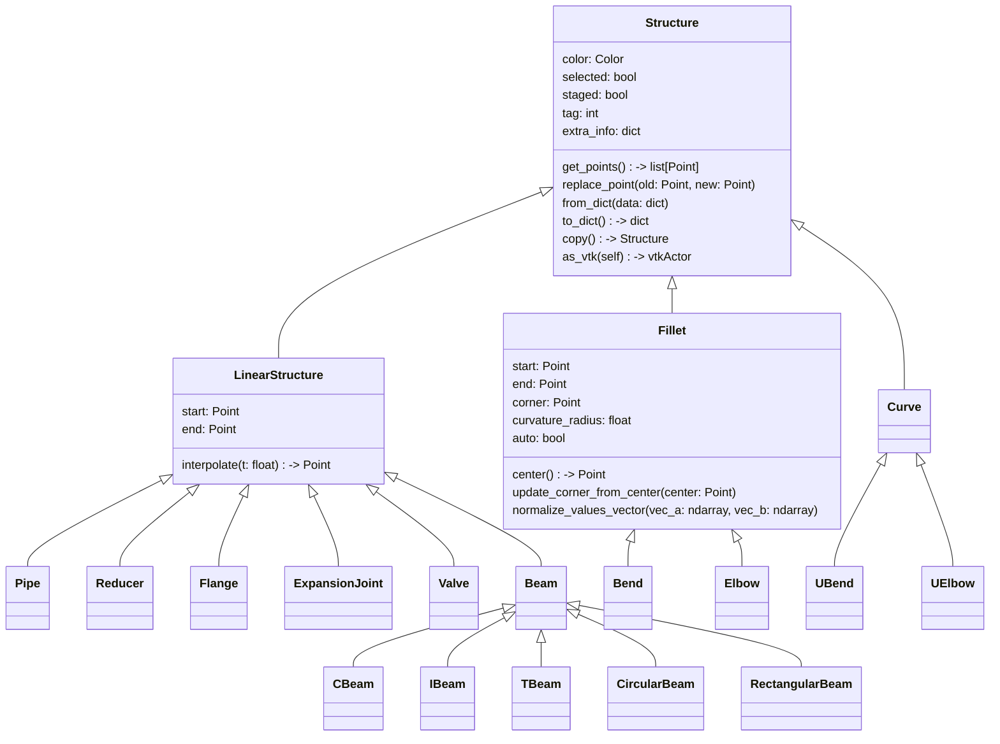

```mermaid
classDiagram

Structure <|-- LinearStructure
Structure <|-- Fillet
Structure <|-- Curve

LinearStructure <|-- Pipe
LinearStructure <|-- Reducer
LinearStructure <|-- Flange
LinearStructure <|-- ExpansionJoint
LinearStructure <|-- Valve
LinearStructure <|-- Beam

Beam <|-- CBeam
Beam <|-- IBeam
Beam <|-- TBeam
Beam <|-- CircularBeam
Beam <|-- RectangularBeam

Fillet <|-- Bend
Fillet <|-- Elbow

Curve <|-- UBend
Curve <|-- UElbow

class Structure {
    color: Color

    selected: bool
    staged: bool

    tag: int
    extra_info: dict

    get_points() -> list[Point]
    replace_point(old: Point, new: Point)

    from_dict(data: dict)
    to_dict() -> dict
    
    copy() -> Structure
    as_vtk(self) -> vtkActor
}

class LinearStructure {
    start: Point
    end: Point

    interpolate(t: float) -> Point
}

class Fillet {
    start: Point
    end: Point
    corner: Point
    curvature_radius: float
    auto: bool

    center() -> Point
    update_corner_from_center(center: Point)
    normalize_values_vector(vec_a: ndarray, vec_b: ndarray)
    
}

```